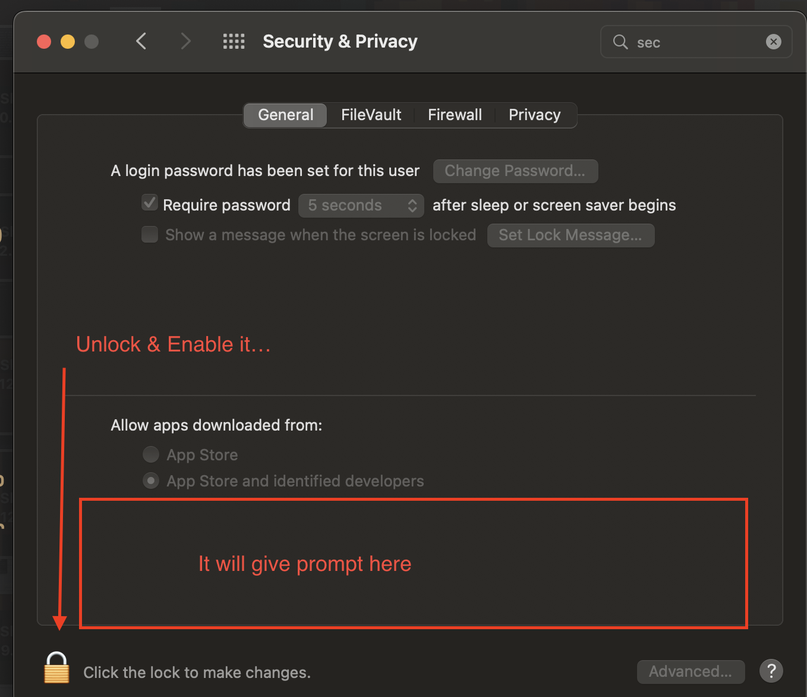
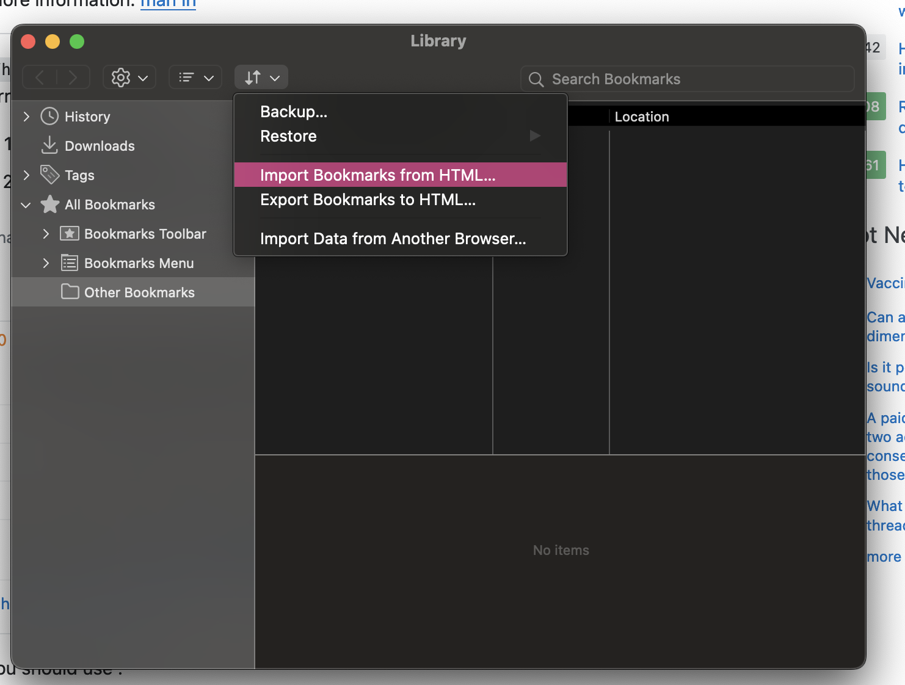

# Tyranitar Dotfiles

<p align="center">  </p>
<p align="center"><b>Tyranitar: My Personal MacOS Work Setup</b></p>

<p align="center">
    
    
    
    
  </p>

## ✨ Table of Contents
* [Screenshots](#Screenshots)
* [Overview](#Overview)
* [Application](#Application)

## Screenshots


## Overview
Tyranitar is my MacOS specific workflow & tools for my work (as software engineer) in various tech company (Tokopedia, Shopee, and in the future).

It contains most of the configuration that I use, mainly tools, application and customization that I use to boost my productivity during working. 

While it feels great for me, Tyranitar might not works well for you, so this repo is meant to archive my my dev toolbox along the year. Think of this dotfiles as your "engineer" work toolbox. A great engineer usually have their own set of tools that they bring everywhere because they feel comfortable using them. Also, lot's of these tools either: 1) Works out of the box after installation, 2) Can be easily configureable using a config file (text)

But, I haven't had time to bootstrap all of these tools setup into a script, so
for now let's be satisfied with the step by step on how to apply these changes.

Also, I'm using [Gruvbox Theme](https://github.com/morhetz/gruvbox) as my color scheme for my daily usage theme (as it pretty comfortable in my eye, others might find it quite old but I like it) and [Jetbrains Nerd Font](https://github.com/ryanoasis/nerd-fonts/blob/master/patched-fonts/JetBrainsMono/Ligatures/Regular/complete/JetBrains%20Mono%20Regular%20Nerd%20Font%20Complete%20Mono.ttf) as default font => because it works well with a lot of Jetbrains tools, something that I use quite often during my work.

## Application

As I'm mainly working with Golang & Java, I usually use:
- Terminal-based Dev Tools:

| Apps           | Description                                          |
| -----------    | -----------                                          |
| Alacritty      | Terminal Emulator                                    |
| Tmux           | Terminal Multiplexer                                 |
| Zsh            | Shell Program in Terminal                            |
| Vim            | For editing config file / remote file                |
| Neovim         | Personal Text Editor (more resource usage)           |
| Lazygit        | Git Client                                           |
| Ctop           | Docker Viewer (similar to htop => but for container) |
| redis-cli      | Redis Client                                         |
| vimwiki        | Note Taking Apps                                     |
| bypytop        | System Usage Profiller                               |
| lf             | File Manager                                         |
| magic-wormhole | Send file to other computer easily & securely        |

- Productivity / Utility Tools:

| Apps               | Description                                                                                                             | Reference                                                                         |
| -----------        | -----------                                                                                                             | -----------                                                                       |
| Scroll reverser    | Emulate natural scroll in Mac                                                                                           | https://pilotmoon.com/scrollreverser/                                             |
| Clipy              | Clipboard Manager                                                                                                       | https://clipy-app.com/                                                            |
| zsh-autosuggestion | Terminal Autosuggestion help                                                                                            | https://github.com/zsh-users/zsh-autosuggestions/blob/master/INSTALL.md#oh-my-zsh |
| z                  | Directory Jumper (for zsh)                                                                                              | https://github.com/agkozak/zsh-z                                                  |
| navi               | Command cheatsheet                                                                                                      | https://github.com/denisidoro/navi                                                |
| tre                | Jump to file / folder in a directory                                                                                    | https://github.com/dduan/tre                                                      |
| rip                | Rm with safety (since i like to remove a file => then later want it back)                                               | https://github.com/nivekuil/rip                                                   |
| fuck               | (don't use it often) sometimes when bad moon, good to have (just type the word and the hopefully command become better) | https://github.com/nvbn/thefuck                                                   |
| atuin              | (very useful) to check old command history => with fzf                                                                  | https://github.com/atuinsh/atuin                                                   |

- GUI-based Dev Tools:

| Apps                                    | Description                                                      |
| -----------                             | -----------                                                      |
| Intellij (v 2022.1.5)                   | Java IDE                                                         |
| Goland (v 2023.1.1)                     | Golang IDE                                                       |
| Webstorm (v 2023.3.4)                   | React + Javascript IDE                                           |
| Dbeaver (v 22.2.5)                      | SQL Editor & Database Client                                     |
| Robo3T                                  | NoSQL Editor & NoSQL Database Client                             |
| Another Redis Desktop Manager (v 1.5.8) | Redis Client                                                     |
| Postman (v10.16)                        | API Client                                                       |
| Mockoon                       | Mock API Server (for mocking external API / other microservices) |
| Firefox                       | Browser. i like it so I don't change it                          |
| Filezilla  (v 3.64.0)         | SFTP-based Client for accessing remote file                      |
| Zoom                          | Online Video Meeting                                             |

- Online Dev Tools (no need installation, can bookmark first!) :

| Apps        | Description                                                                            | Link / Reference                      |
| ----------- | -----------                                                                            | -----------                           |
| ChatGPT     | An AI master for alot of my programming problem                                        | https://chat.openai.com/              |
| Bard        | An AI master for alot of my programming problem (when i need to reference on internet) | https://bard.google.com/              |
| Excalidraw  | An online whiteboard (for initial planning of task / project)                          | https://excalidraw.com/               |
| Tldraw      | (Same whiteboard) But more useful when writing flowchart & sequence diagram            | https://www.tldraw.com/               |
| JSON editor | An online json editor (because vieweing it is hard)                                    | https://jsoneditoronline.org          |
| UML editor  | An online plant-UML based editor (to draw sequence diagram)                            | https://plantuml-editor.kkeisuke.com/ |
| Yaml linter | An online yaml linter (to yaml based configuration)                                    | https://yamlchecker.com/              |
| PwPush      | An online password & credential sharing system                                      | https://pwpush.com/              |


- Browser Extension:

| Apps                | Description                                                      | Reference                                             |
| -----------         | -----------                                                      | -----------                                           |
| Vimium C            | An extension to help using vim keybind on firefox/chrome browser | https://github.com/gdh1995/vimium-c                   |
| Youtube Ads Blocker | An extension to help listen to music without ads                 | https://mybrowseraddon.com/adblocker-for-youtube.html |

- Gaming:
| Apps                | Description                                                      | Reference                                             |
| -----------         | -----------                                                      | -----------                                           |
| XPAD                | For controller setting in linux based system                     | https://github.com/paroj/xpad                         |
| Bottles             | Run .exe in linux                                                | https://github.com/bottlesdevs/Bottles                |

## How to setup...
(anyway, the below process is a little bit deprecated (i don't always update this part since it contains a lot)) => just remember, there are only few tools that we need to setup correctly => like neovim, gitconfig (lazygit), and tmux => for the other one, i won't complain even if we only use default setup provided by the tools)


Here is the step by step to setup all my work laptop. This is not going to be a script that are run once, but a step by step and reference on how to install it.

**Homebrew**
0. Install xcode dev tools
```bash
$ xcode-select --install
```
1. Verify Installation of xcode (should show result if installed properly)
```bash
$ xcode-select -p
```
2. Install homebrew
```bash
$ /bin/bash -c "$(curl -fsSL https://raw.githubusercontent.com/Homebrew/install/HEAD/install.sh)"
```
3. Update homebrew & check the installation
```bash
$ brew update && brew doctor
```
4. Install Go v1.17
```bash
$ brew install go@1.17
```
5. Install Node & NPM
```bash
$ brew install node
```

**Zsh** (need change later)
0. Install zsh
```bash
$ brew install zsh
```
1. Setup the .zshrc & alias with PATH
```bash
$ ln .zshrc ~/.zshrc 
```
2. Install omz for theme
```bash
$ sh -c "$(wget https://raw.githubusercontent.com/ohmyzsh/ohmyzsh/master/tools/install.sh -O -)"
```
3. Setup terminal prompt (POWERLEVEL 10K)
```bash
$ git clone --depth=1 https://github.com/romkatv/powerlevel10k.git ${ZSH_CUSTOM:-$HOME/.oh-my-zsh/custom}/themes/powerlevel10k
```
4. Configure powerlevel10k with helper wizard
```bash
$ p10k configure
```
5. Install directory jumper (guide:
https://github.com/agkozak/zsh-z#installation)
6. Install zsh autosuggestion (guide:
https://github.com/zsh-users/zsh-autosuggestions/blob/master/INSTALL.md#oh-my-zsh)

**Jetbrains Mono Nerd Font**
1. Tap the homebrew
```bash
$ brew tap homebrew/cask-fonts
```
2. Install the font
```bash
$ brew install --cask font-jetbrains-mono
```
3. Check if the font already installed or not in the Font Book (Mac Built-in
Apps)

**Alacritty**
1. Install alacritty via homebrew
```bash
$ brew install --cask alacritty
```
2. Enable application from system preference


3. Setup alacritty with custom configuration
```bash
$ cd ~/.config/ && ln <path-to-dotfile>/alacritty alacritty
```
4. Reload...

**Vim**
1. Vim installation should be done by system (available immediately...)
2. Copy .vimrc to `~/.vimrc` in ~/ directory
```bash
$ cp .vimrc ~/.vimrc
```
3. (Optional) Or, link the .vimrc to the ~/.vimrc
```bash
$ ln .vimrc ~/.vimrc
```

**Git**
1. Copy the .gitconfig file (or you could link it)
```bash
$ ln .gitconfig ~/.gitconfig
```
2. Copy the .ssh folder (or you could link it) -> maybe not available in repo
```bash
$ cd && ln <path-to-dotfile>/.ssh .ssh
```
3. Copy the .netrc file for authentication issue when accessing some repo
```bash
$ ln .netrc ~/.netrc
```

**Tmux**
1. Install tmux
```bash
$ brew install tmux
```
2. Setup tmux configuration (using oh-my-tmux, with slight modification)
```bash
$ cp ./tmux.conf ~/.tmux.conf && cp ./tmux.conf.local ~/.tmux.conf.local
```
3. Or, can link the config file to the ~/ directory
```bash
$ ln ./tmux.conf ~/.tmux.conf && ln /tmux.conf.local ~/.tmux.conf.local
```

**Neovim**
1. Install neovim via homebrew (v.0.8)
```bash
$ brew install neovim
```
2. Copy .config/nvim directory to ~/.config/nvim 
```bash
$ cp -r .config/nvim ~/.config/nvim
```
3. (Optional) Or, link the directory
```bash
$ cd ~/.config && ln <path-to-dotfile>/.config/nvim nvim
```
4. Save the plugin file to re-download all neovim plugin used
```bash
$ nvim ~/.config/nvim/lua/user/plugin.lua  
```

**Intellij / Go / Webstorm**

**Lazygit**

**Lazydocker**

**Firefox**
1. Install Firefox Developer Version using homebrew
```bash
$ brew tap homebrew/cask-versions
$ brew install --cask firefox-developer-edition
```
2. Import bookmark (from bookmark manager)

3. Change the theme to Gruvbox (ref: https://addons.mozilla.org/en-US/firefox/addon/gruvbox-dark-theme/)
4. Add Vimium addsOn (ref: https://addons.mozilla.org/en-US/firefox/addon/vimium-c/)
5. Add Youtube AddsOn (ref: https://addons.mozilla.org/id/firefox/addon/adblock-for-youtube/)
6. Apply Firefox CSS (ref: https://github.com/andreasgrafen/cascade)

**Fig**
1. Install using brew
```bash
$ brew install fig
```

## ❤️ Support
If you feel that this repo have helped you provide more example on learning software engineering, then it is enough for me! Wanna contribute more? Please ⭐ this repo so other can see it too!
