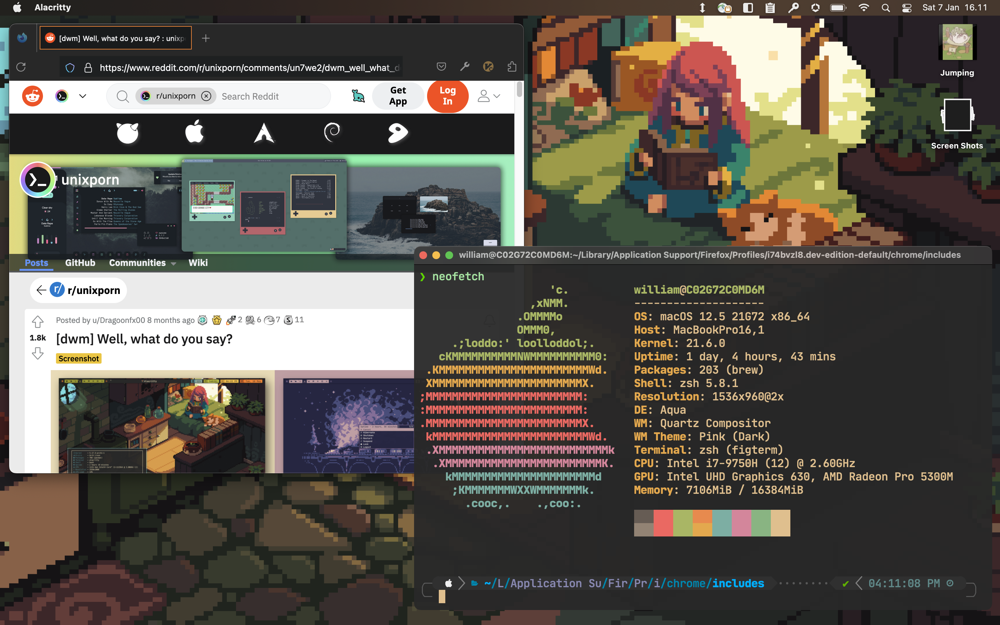

# Tyranitar Dotfiles

<b>Tyranitar: My Personal MacOS Work Setup</b>

    
    
    
    
    
  

## ✨ Table of Contents
* [Screenshots](#Screenshots)
* [Overview](#Overview)
* [Application](#Application)

## Screenshots

## Overview
Tyranitar is my MacOS specific workflow & tools for my daily work (as software engineer) in Shopee.
It contains most of the configuration that I use, mainly application and customization for my programming setup. 

While it feels great for me, Tyranitar might not works well for you, so this repo is meant to archive my my dev toolbox along the year. Think of this dotfiles as your "engineer" work toolbox. A great engineer usually have their own set of tools that they bring everywhere because they feel comfortable using them.

 I'm using [Gruvbox Theme]() as my color scheme for my daily usage theme (as it pretty comfortable in my eye, others might find it quite old but I like it) and [Jetbrains Nerd Font]() as default font.

## Application
As I'm mainly working with Golang & Java, I usually use:
- tmux : to control pane and window in terminal
- alacritty : as my terminal emulator
- zsh : as my shell
- Neovim : as my fully Text Editor
- VSCode : as my debugging tools (i only open it to debug my apps lol...)
- Intellij : as my IDE (when working with Java), along with the .ideavimrc
- Lazygit : as my git client
- Lazydocker : to help view my running docker application
- redis-cli : as my redis client
- dbeaver : as my database client GUI apps
- Postman : for my API Client GUI apps
- Mockoon : for my Mock API apps
- htop : system profiller
- vimwiki / Notes : personal note taking apps
- Firefox : browser
- Zoom : online video meeting

## How to setup...
Here is the step by step to setup all my work laptop. This is not going to be a script that are run once, but a step by step and reference on how to install it.

**Tmux**

## ❤️ Support
If you feel that this repo have helped you provide more example on learning software engineering, then it is enough for me! Wanna contribute more? Please ⭐ this repo so other can see it too!
