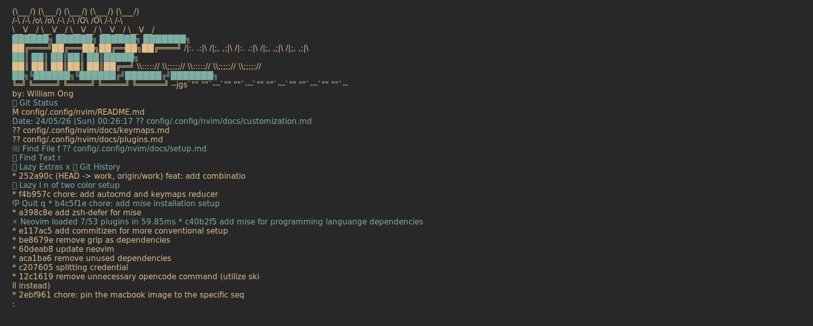
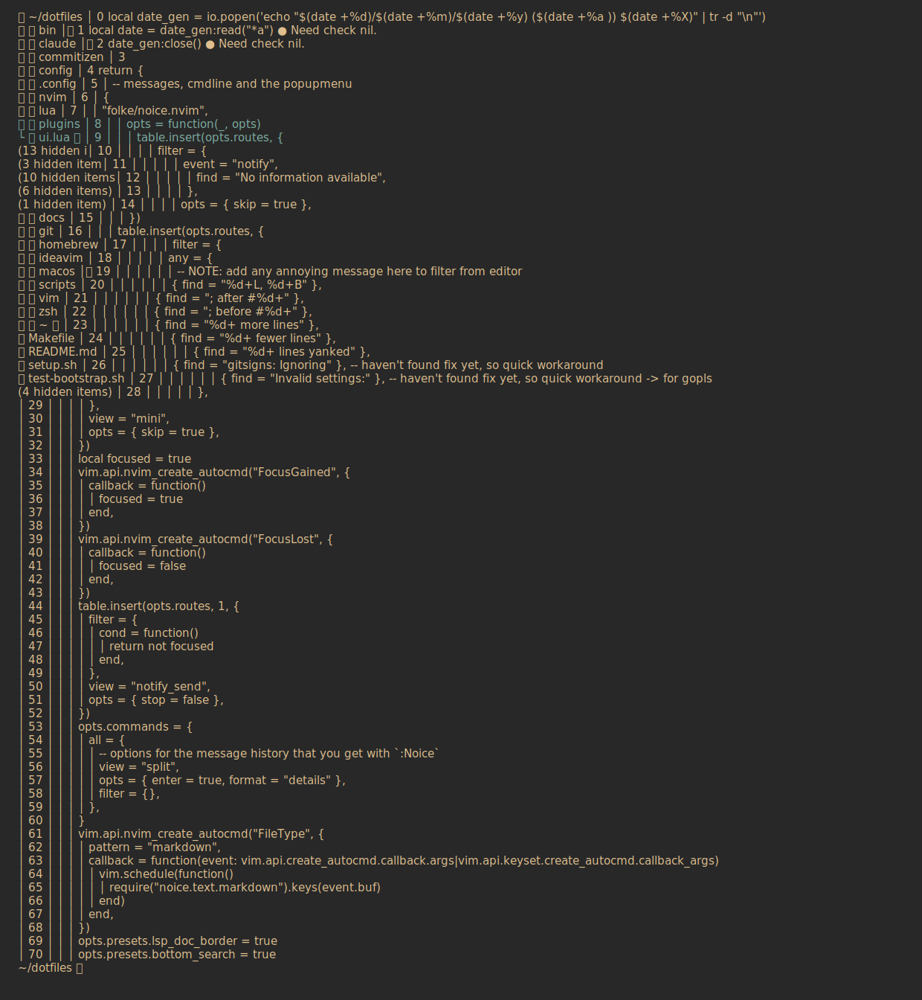
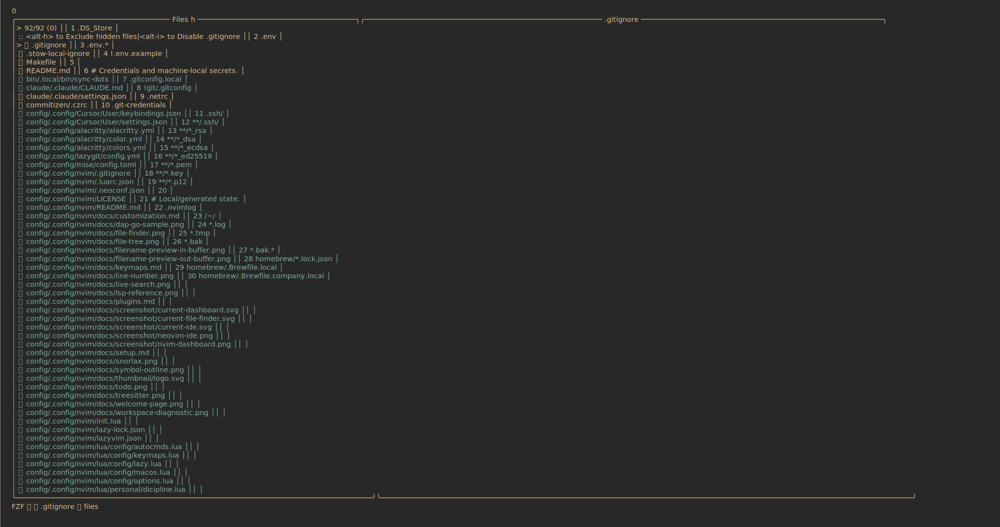
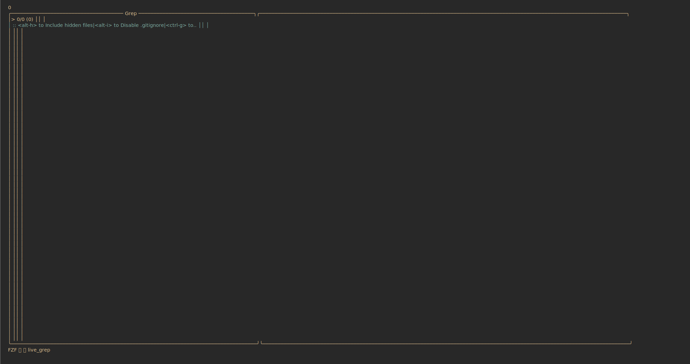

# Screenshots

The current screenshots are SVG terminal snapshots generated from live Neovim sessions and styled with the active Alacritty palette from `config/.config/alacritty/colors.yml`:

```sh
/Applications/Alacritty.app/Contents/MacOS/alacritty \
  --working-directory /path/to/dotfiles \
  -e zsh -lc 'XDG_CONFIG_HOME=/path/to/dotfiles/config/.config nvim'
```

Native macOS raster capture was attempted through Alacritty and Kitty, but this session could not create window images because Screen Recording/window capture is blocked. The SVG files below use the current Neovim terminal contents, the installed `JetBrainsMono Nerd Font` family, and Alacritty's Gruvbox Material colors:

- Background: `#282828`
- Foreground: `#dfbf8e`
- Accent: `#7daea3`

## Dashboard



The dashboard comes from `folke/snacks.nvim`. It shows the custom `.code` header, generated date, dashboard actions, startup stats, Git status, Git history, and optional `artprint` terminal art.

Configured in:

- `lua/plugins/ui.lua`

## IDE View



This view opens `lua/plugins/ui.lua` with Neo-tree revealed. It shows the file explorer, code buffer, diagnostics, and statusline styling.

Configured by:

- `lua/plugins/editor.lua`
- `lua/plugins/ui.lua`
- `lua/plugins/colorscheme.lua`
- `lua/plugins/lsp.lua`

## File Finder



The file finder is powered by `fzf-lua`, which is selected as LazyVim's picker backend through:

```lua
vim.g.lazyvim_picker = "fzf"
```

Configured in:

- `lua/config/options.lua`
- `lua/plugins/finder.lua`

## Live Grep



Live grep is also powered by `fzf-lua`. The captured view shows the current prompt and preview layout before a search query is entered.

Configured in:

- `lua/plugins/finder.lua`

## Legacy PNGs

The `docs/` folder still contains older PNG screenshots used by previous README versions. Keep them only if they are useful historically; prefer the `screenshot/alacritty-*.svg` files for current documentation because they were generated from the present config and styled with the configured Alacritty colors.
