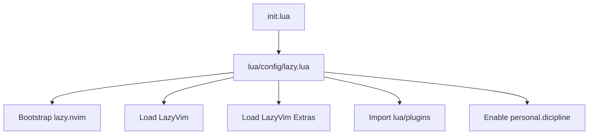

# Setup

This Neovim config is designed to live at `~/.config/nvim` and is managed with `lazy.nvim` plus LazyVim.

## Prerequisites

Required:

- Neovim 0.10 or newer.
- Git.
- A terminal with true color support.
- A Nerd Font-compatible font for icons.

Recommended:

- `ripgrep` for text search.
- `fd` for fast file discovery.
- `lazygit` for Git workflows.
- `python3`, Go, Rust, Ruby, Node.js, and Terraform toolchains as needed by your projects.

LazyVim and Mason can install many editor-side tools, but project-specific formatters and linters may still need to be installed by the project package manager.

## Install

Back up existing Neovim config and state:

```sh
mv ~/.config/nvim ~/.config/nvim.bak
mv ~/.local/share/nvim ~/.local/share/nvim.bak
mv ~/.local/state/nvim ~/.local/state/nvim.bak
mv ~/.cache/nvim ~/.cache/nvim.bak
```

Link this config from the dotfiles repo:

```sh
ln -s /path/to/dotfiles/config/.config/nvim ~/.config/nvim
```

Start Neovim:

```sh
nvim
```

On first launch, `lua/config/lazy.lua` bootstraps `lazy.nvim` if it is missing, then installs the plugin graph from `lazy-lock.json`.

## First Launch

After Neovim opens:

1. Wait for `lazy.nvim` to finish installing plugins.
2. Run `:Lazy` if you want to inspect plugin state.
3. Run `:Mason` to inspect external language tools.
4. Restart Neovim after the first install so all lazy-loaded modules can initialize cleanly.

The config disables Lazy's automatic update checker, so plugin updates should be intentional.

## Main Startup Flow



## Important Files

- `init.lua` loads `config.lazy`.
- `lua/config/lazy.lua` owns LazyVim imports, plugin loading, and Lazy settings.
- `lua/config/options.lua` owns editor options and global LazyVim toggles.
- `lua/config/keymaps.lua` owns global keymaps.
- `lua/config/autocmds.lua` owns custom autocommands.
- `lua/plugins/` owns plugin-specific overrides.
- `lazy-lock.json` pins plugin revisions.

## Troubleshooting

If plugins do not install, open `:Lazy` and run `Sync`.

If language tools are missing, open `:Mason` and install the missing server, formatter, or debugger.

If icons render as boxes, install and select a Nerd Font in your terminal.

If search is slow or missing results, install `ripgrep` and `fd`.
